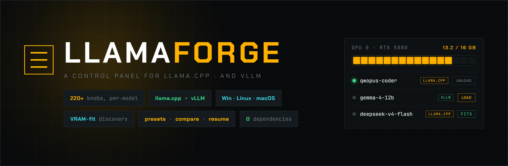
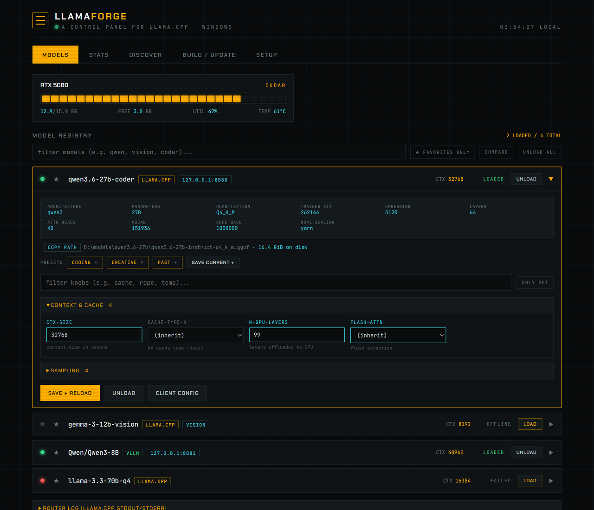
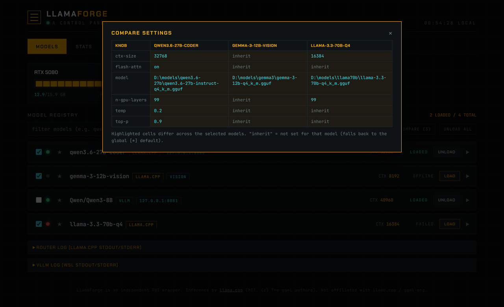
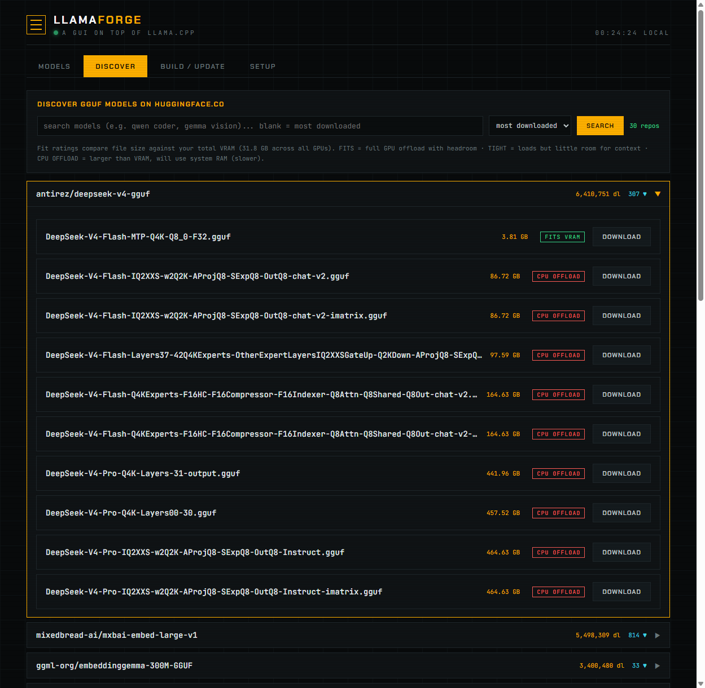

<p align="center">
  
</p>

<p align="center">
  <a href="https://github.com/ggml-org/llama.cpp"></a>
  
  
  <a href="LICENSE"></a>
  
</p>

<p align="center">
  <a href="https://github.com/dadwritestech/LlamaForge/actions/workflows/ci.yml"></a>
  <a href="https://github.com/dadwritestech/LlamaForge/stargazers"></a>
  <a href="https://github.com/dadwritestech/LlamaForge/network/members"></a>
  <a href="https://github.com/dadwritestech/LlamaForge/issues"></a>
  <a href="https://github.com/dadwritestech/LlamaForge/pulls"></a>
  <a href="https://github.com/dadwritestech/LlamaForge/commits/master"></a>
  
</p>

# LlamaForge

A graphical control panel for [llama.cpp](https://github.com/ggml-org/llama.cpp):
build it, keep it current with upstream, discover models that fit your hardware,
tune **every** server parameter per model, and run — all from your browser instead
of hand-editing `models.ini` and long `llama-server` command lines.

**Who it's for:** people who want llama.cpp's speed and control but would rather not
memorize flags, edit config files by hand, or babysit build commands. It assumes
you're comfortable running a setup script once and building llama.cpp for your
machine — both guided from the dashboard. Windows with an NVIDIA GPU is the
primary target (CPU-only works too); **Linux** (NVIDIA/CPU) and **macOS**
(Apple Silicon, Metal) are supported as an early preview — same dashboard,
`bootstrap.sh` instead of `bootstrap.ps1`. **Looking for something else?** If you want a zero-config, double-click
installer with no compile step, [LM Studio](https://lmstudio.ai),
[Ollama](https://ollama.com), or [Jan](https://jan.ai) will get you running faster —
LlamaForge trades that for direct, per-model control over the real llama.cpp server.

> LlamaForge is an independent wrapper and is **not affiliated with llama.cpp / ggml-org**.
> All inference, model support, and performance come from llama.cpp (MIT, (c) The ggml
> authors). See [NOTICE](NOTICE). Please support the upstream project.

## Features

| Tab | What it does |
|-----|--------------|
| **Models** | Every model on your machine in one list with live GPU VRAM/util/temp meters (used **and** free). Expand a model to edit all **~220 llama.cpp knobs** (context, KV-cache type, speculative decoding, tensor split, sampling, rope, ...), grouped and searchable, with the file path, on-disk size, and a **GGUF metadata card** (architecture, parameters, quantization, trained context, layers, attention heads, rope). Save hot-reloads with no restart; **quick-load/unload right from the row header**, with load requests **queued** so a second load waits its turn. A failed load shows the **real error inline with a suggested fix** instead of making you scroll the log. Save any knob set as a **named preset** and apply it to any model in one click, **compare** 2–3 models side-by-side to see what differs, and copy a ready-to-paste **curl / OpenAI-client / JSON** snippet per model. A full **keyboard map** drives the tab, and the expanded row + unsaved edits persist across reloads. |
| **Stats** | Per-model usage tracked from the router's own metrics: tokens processed, average generation speed (tok/s), run counts, time loaded, and a stacked prompt/generated activity chart (14- or 30-day). Live throughput while a model runs. Resettable. (Totals are per-model across all clients — per-request/per-IP isn't shown because clients hit the router directly, so the dashboard never sees individual request origins.) |
| **Discover** | Search **huggingface.co** for **GGUF** (llama.cpp) or **safetensors** (vLLM) models (newest / most downloaded / most liked). Every quant is rated against your total VRAM - **FITS / TIGHT / CPU OFFLOAD** - before you download, and each result is tagged with the platforms it runs on plus **GATED** and **INSTALLED** badges. One click streams the download (multi-shard + vision mmproj handled) with live speed/ETA, **pause/resume** (large downloads resume via HTTP range instead of restarting from zero) and cancel, then registers it in your registry. |
| **Build / Update** | Shows your current llama.cpp commit, checks GitHub for how far behind you are (cached, so opening the tab doesn't re-hit GitHub every time — with a manual **Check GitHub now**), and rebuilds via CMake with flags **auto-detected for your CPU/GPU/Apple Silicon** (CUDA arch, AVX-512, quantized-KV flash attention, or Metal). Prior binaries are backed up; the build streams live and reports its duration. Also tracks the installed **vLLM** version against PyPI and updates it in place. |
| **Setup** | Checks prerequisites (Git, CMake, Ninja, Python, C++ compiler, CUDA), installs missing ones **with your permission** (winget/choco on Windows, Homebrew on macOS; exact commands shown on Linux — the dashboard never runs `sudo`) or links official downloads. Detects hardware and scans your drives (or `$HOME` + mounts) for existing GGUF models. **Check for deleted models** prunes registry entries whose file has since been removed from disk. Installs the **vLLM** backend into WSL2 (Windows), and lets you pick a **favourite model to auto-load on launch**. |

## Two engines: llama.cpp + vLLM

LlamaForge is a llama.cpp control panel first, but it can also drive **[vLLM](https://github.com/vllm-project/vllm)** as a second backend for full-precision / safetensors models (FP16, BF16, AWQ, GPTQ, FP8, NVFP4). Both engines share the same Models list, Discover tab, and stats — each row is tagged **llama.cpp** or **vLLM**.

- **Windows:** vLLM runs inside **WSL2** with GPU passthrough. Install it from the **Setup** tab (uv + a standalone Python into `~/.llamaforge/vllm-venv`, no `sudo`); the dashboard bridges WSL's localhost port back to Windows. vLLM runs one model at a time and has no hot reload, so saving knobs on a loaded model restarts it — startup can take 1–5 minutes; watch the **vLLM Log** panel.
- **Linux / macOS:** vLLM is a Windows/WSL2 feature; its tab and Discover's safetensors mode are hidden automatically. llama.cpp (CUDA/CPU on Linux, Metal on Apple Silicon) is the engine there.

Everything you download for vLLM lands in the WSL model cache and is registered like any other model. If you only ever want llama.cpp, you can ignore vLLM entirely — nothing about it is installed unless you ask.

## Cross-platform

The same dashboard runs everywhere; only the launcher scripts differ.

| | Windows | Linux | macOS (Apple Silicon) |
|---|---|---|---|
| llama.cpp | CUDA / CPU | CUDA / CPU | Metal |
| vLLM | via WSL2 | — | — |
| bootstrap | `bootstrap.ps1` | `bootstrap.sh` | `bootstrap.sh` |
| daily run | `LlamaForge.vbs` | `./run.sh` | `./run.sh` |
| package manager (Setup tab) | winget / choco | apt / dnf / pacman *(commands shown, never auto-`sudo`)* | Homebrew |

## Quality-of-life

Small things that add up when you use it every day:

- **Quick-load** — load/unload from the row header without expanding; a **load queue** serializes multiple loads instead of erroring.
- **Named presets** — save a knob set ("coding", "creative", "fast") and apply it to any model in a click.
- **Inline failure diagnosis** — a failed load parses the router log and shows the real error plus a concrete suggested fix (e.g. "lower n-gpu-layers from 99").
- **GGUF metadata card** — architecture, parameter size, quant, trained context, layers, heads, and rope, read straight from the file header.
- **Compare** — pick 2–3 models and see their settings side-by-side with the differences highlighted.
- **Client config** — one click gives you a copy-paste `curl`, OpenAI-client env vars, and a test JSON payload wired to that model's endpoint and API key.
- **Download pause/resume** — a 25 GB download that gets interrupted resumes from where it stopped via an HTTP range request.
- **Auto-load on launch** — pick a favourite model in Setup and it loads itself once the router is ready.
- **Persistent UI** — the expanded row, unsaved edits, favourites, and last Discover search all survive tab switches and reloads.
- **Optional system tray** — a tray icon showing the loaded-model count and a quick "Open dashboard" (Windows/Linux; `pip install pystray pillow` to enable — without it LlamaForge stays pure-stdlib).

### Keyboard shortcuts (Models tab)

| Key | Action |
|-----|--------|
| `1`–`5` | switch tabs (Models / Stats / Discover / Build / Setup) |
| `/` | focus the model filter (`Esc` clears it) |
| `↑` / `↓` or `k` / `j` | move the row selection |
| `Enter` | expand / collapse the selected row |
| `L` / `U` | load / unload the selected model |
| `S` | save the open model's knobs |
| `Esc` | close an open dialog |

## Screenshots

| Models — GGUF metadata, presets, per-model knobs, quick-load | Compare models side-by-side |
|---|---|
|  |  |

| Discover with VRAM-fit ratings | Setup & hardware detection |
|---|---|
|  |  |

## Quick start (new machine)

**Windows**

```powershell
git clone https://github.com/dadwritestech/LlamaForge
cd LlamaForge
powershell -ExecutionPolicy Bypass -File bootstrap.ps1
```

**Linux / macOS**

```bash
git clone https://github.com/dadwritestech/LlamaForge
cd LlamaForge
./bootstrap.sh        # then ./run.sh daily, ./stop.sh to shut down
```

The bootstrap script (`bootstrap.ps1` on Windows, `bootstrap.sh` on Linux/macOS)
ensures Python + Git (asking before installing anything), fetches llama.cpp if you
don't have it, writes `config.json`, and opens the dashboard. From there: **Setup**
to install any missing compiler/CUDA and scan your drives, **Build** to compile
llama.cpp for your hardware, **Models** to tune and run. A **Getting Started**
checklist on the Models tab walks you through these three steps on a fresh install.

## Daily use

**Windows:** double-click **`LlamaForge.vbs`**. It starts the llama.cpp router and
the dashboard hidden, then opens your browser. For autostart, put a shortcut to it in
your Startup folder (`Win+R` -> `shell:startup`).

**Linux / macOS:** run **`./run.sh`** — same thing, starts the router and dashboard
and opens your browser.

- Dashboard: http://127.0.0.1:8090
- llama.cpp chat UI + OpenAI-compatible API: http://127.0.0.1:8080

To shut everything down — the dashboard, the router, and every model instance the
router spawned — run the stop script for your OS:

```powershell
powershell -ExecutionPolicy Bypass -File stop.ps1   # Windows
./stop.sh                                            # Linux / macOS
```

## Requirements

- Windows 10/11 (primary), or Linux / macOS (Apple Silicon) as an early preview
- Python 3.10+ (backend is **pure stdlib** - nothing to `pip install`)
- NVIDIA GPU for CUDA acceleration (Metal on Apple Silicon; CPU-only builds also
  supported everywhere)
- Everything else (Git, CMake, Ninja, C++ compiler, CUDA) is detected and can be
  installed from the Setup tab where a package manager allows it
- **vLLM backend (optional, Windows):** WSL2 with GPU passthrough — installed from
  the Setup tab
- **System tray (optional):** `pip install pystray pillow`; without it the tray is
  simply skipped and the backend stays pure-stdlib

## Configuration

All machine-specific paths live in `config.json` (see `config.example.json`):

| key | meaning |
|-----|---------|
| `llama_src` | your llama.cpp git checkout |
| `build_dir` | CMake build directory |
| `server_bin` | path to `llama-server` (`llama-server.exe` on Windows) |
| `models_ini` | the router preset file LlamaForge edits |
| `model_dirs` | directories to scan for GGUFs (empty = all fixed drives) |
| `router_port` / `panel_port` | ports for llama.cpp and the dashboard |
| `router_host` | `127.0.0.1` (default, local only) or `0.0.0.0` (reachable on your LAN) |
| `router_api_key` | key clients send as `Authorization: Bearer <key>`; strongly recommended (and enforceable) whenever `router_host` isn't `127.0.0.1` |
| `auto_load_model` | model id to load automatically once the router is ready on launch (`""` = none) |
| `presets` | named knob sets applied from the Models tab, e.g. `{"coding": {"temp": "0.2"}}` |
| `wsl_distro` | WSL distro that runs vLLM (`""` = auto-pick the default) — Windows only |
| `vllm_port` | port vLLM serves on inside WSL, forwarded to Windows localhost |

Most of these are managed from the dashboard (Setup, Build, and the Models tab), so
you rarely edit `config.json` by hand.

By default everything binds to `127.0.0.1` only. The Setup tab has a **Network
Access** panel to opt into serving the llama.cpp API/chat UI to other devices on
your network (e.g. `http://192.168.1.x:8080/`) and restarts the router for you,
no manual editing needed. A **Require an API key** toggle (on by default) blocks
LAN access until you set or generate a key; leaving it unchecked exposes the
router unauthenticated. See [SECURITY.md](SECURITY.md).

## How it works

LlamaForge contains **no llama.cpp source code**. The backend
(`backend/server.py`, pure Python stdlib) proxies llama.cpp's own router API, edits
`models.ini`, and shells out to `git` / `cmake` / `nvidia-smi` and the platform's
package manager (`winget`/`choco`, `brew`, or `apt`/`dnf`/`pacman`). Everything
OS-specific lives behind one small `osplat` module. The knob list is parsed live from
`llama-server --help`, so it stays correct across llama.cpp versions automatically.
HuggingFace downloads are streamed by the backend, so they work even when llama.cpp
is built without SSL.

When models are registered, LlamaForge reads each GGUF's trained context length
straight from its header and writes sensible `ctx-size` defaults into `models.ini`
(a **150k** global baseline; **100k** for models that can't reach it, capped at the
model's own trained length so nothing is over-extended). Per-model settings you set
by hand always win.

## Roadmap

Linux/macOS support and a **vLLM** backend (via WSL2 on Windows) have landed as
early previews, along with named **knob presets** (a step toward full launch
profiles); ik-llama and engine+model launch profiles are next. See
[ROADMAP.md](ROADMAP.md) for what's shipped, in progress, and planned — it's an
early preview, so priorities follow feedback.

## Credits & license

LlamaForge is MIT-licensed ([LICENSE](LICENSE)). It builds and drives
**[llama.cpp](https://github.com/ggml-org/llama.cpp)** - MIT, (c) The ggml authors -
see [NOTICE](NOTICE) and [LICENSE.llama.cpp.txt](LICENSE.llama.cpp.txt).
The hard part is theirs; please star and support the upstream project.
