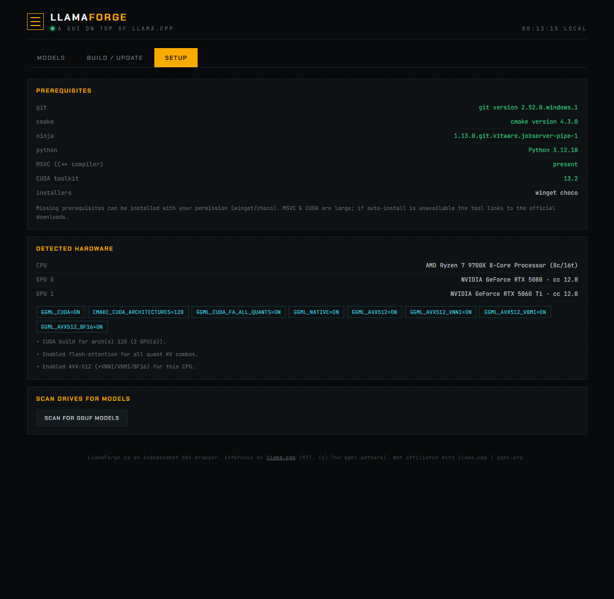

# LlamaForge

A graphical control panel that sits on top of [llama.cpp](https://github.com/ggml-org/llama.cpp):
build it, keep it current with upstream, discover your models across every drive,
tune **every** server parameter per model, and load/run - all from a browser, no
command line.

> LlamaForge is an independent wrapper and is **not affiliated with llama.cpp / ggml-org**.
> All inference, model support, and performance come from llama.cpp (MIT, (c) The ggml
> authors). See [NOTICE](NOTICE). Please support the upstream project.



## What it does

- **Models tab** - every model on your machine in one list with live GPU VRAM/temp
  meters. Expand any model to edit all ~220 llama.cpp knobs (context, KV-cache type,
  speculative decoding, tensor split, sampling, rope, etc.), grouped and searchable.
  Save writes `models.ini` and hot-reloads with no restart. Load / unload in a click.
- **Discover tab** - search huggingface.co for GGUF models (newest / most downloaded /
  most liked). Every quant file is rated against your total VRAM (FITS / TIGHT /
  CPU OFFLOAD) so you know what will run well *before* downloading. One click streams
  the download (shards and vision mmproj handled automatically) and registers the
  model in your registry, ready to load.
- **Build / Update tab** - shows your current llama.cpp commit, checks GitHub for how
  many commits you're behind, and rebuilds via CMake with flags auto-detected for your
  CPU/GPU. Prior binaries are backed up first; the build streams live.
- **Setup tab** - checks prerequisites (Git, CMake, Ninja, Python, MSVC, CUDA) and
  installs missing ones with your permission (winget/choco), or links the official
  download. Detects your hardware and scans all drives for GGUF models to add.

## Requirements

Windows 10/11, an NVIDIA GPU for CUDA acceleration (CPU-only also works), and Python
3.10+. Everything else (Git, CMake, Ninja, the C++ compiler, CUDA) can be installed
from the Setup tab.

## Quick start (new machine)

```
git clone <this-repo> LlamaForge
cd LlamaForge
powershell -ExecutionPolicy Bypass -File bootstrap.ps1
```

`bootstrap.ps1` ensures Python + Git, fetches llama.cpp if you don't have it, writes a
`config.json`, and opens the dashboard. From there use **Setup** to install any missing
compiler/CUDA and scan your drives, **Build** to compile llama.cpp, then **Models** to
tune and run.

## Daily use

Double-click **LlamaForge.vbs** (or run `run.ps1`). It starts the llama.cpp router and
the dashboard hidden, then opens your browser. To start automatically at logon, drop a
shortcut to `LlamaForge.vbs` in your Startup folder.

- Dashboard: http://127.0.0.1:8090
- llama.cpp router / chat + OpenAI-compatible API: http://127.0.0.1:8080

## Configuration

All machine-specific paths live in `config.json` (copy `config.example.json`):

| key | meaning |
|-----|---------|
| `llama_src` | your llama.cpp git checkout |
| `build_dir` | CMake build directory |
| `server_bin` | path to `llama-server.exe` |
| `models_ini` | the router's model preset file LlamaForge edits |
| `model_dirs` | directories to scan for GGUFs (empty = all fixed drives) |
| `router_port` / `panel_port` | ports for llama.cpp and the dashboard |

## How it works

LlamaForge is pure-Python stdlib (no dependencies) plus a static web dashboard. The
backend (`backend/server.py`) proxies llama.cpp's own router API, edits `models.ini`,
and shells out to `git` / `cmake` / `nvidia-smi` / `winget`. It contains **no llama.cpp
source** - it builds and drives the real thing.

## Credits & license

LlamaForge is MIT-licensed (see [LICENSE](LICENSE)). It builds and runs
**llama.cpp**, MIT (c) The ggml authors - https://github.com/ggml-org/llama.cpp -
see [NOTICE](NOTICE) and [LICENSE.llama.cpp.txt](LICENSE.llama.cpp.txt). Huge thanks to
the llama.cpp and ggml community, who did the hard part.
