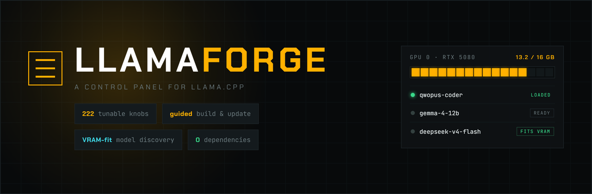
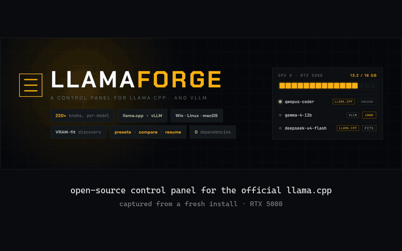
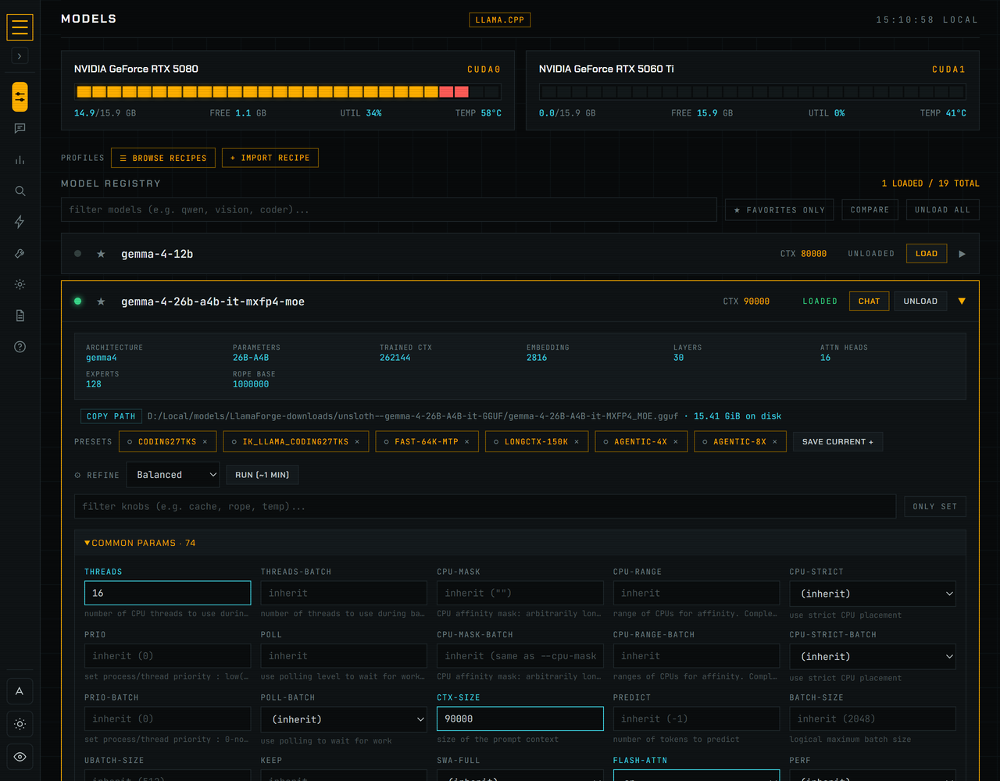
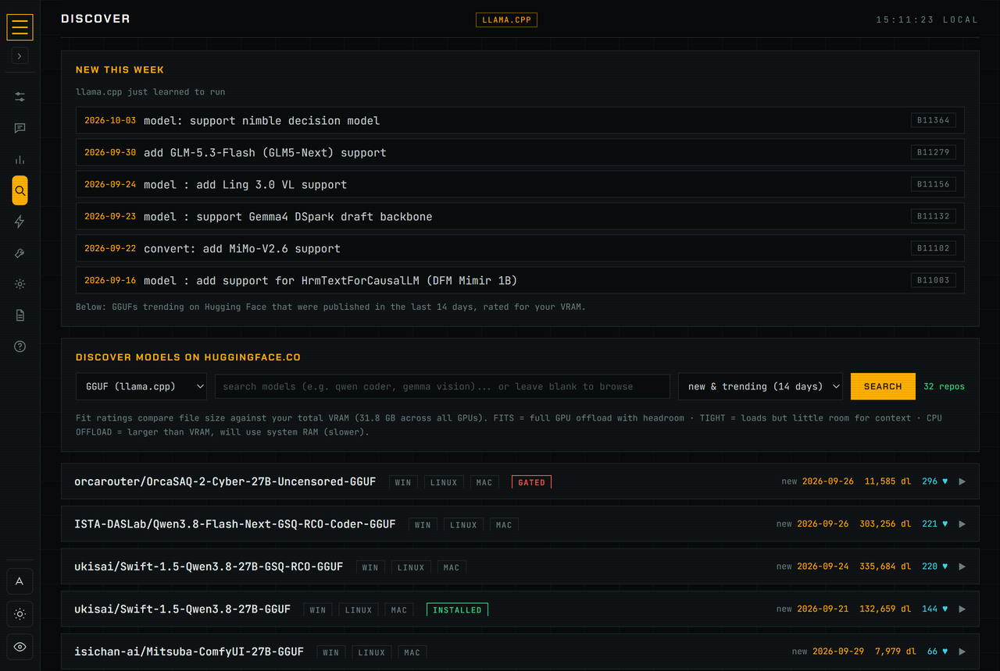
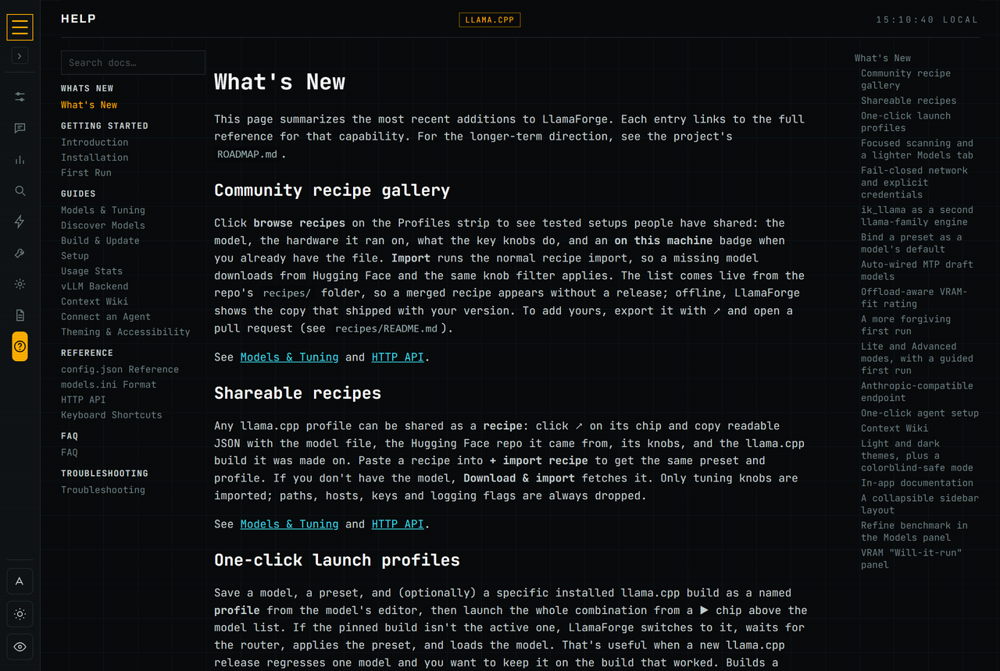
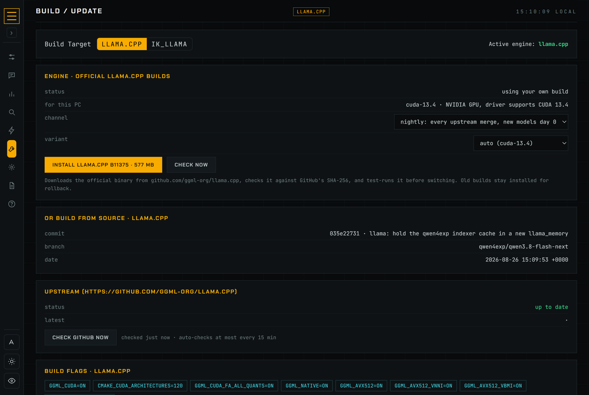

<p align="center">
  <picture>
    <source srcset="docs/hero.webp" type="image/webp">
    
  </picture>
</p>

<p align="center">
  <a href="https://github.com/ggml-org/llama.cpp"></a>
  
  
  <a href="LICENSE"></a>
  
</p>

<p align="center">
  <a href="https://github.com/dadwritestech/LlamaForge/actions/workflows/ci.yml"></a>
  <a href="https://github.com/dadwritestech/LlamaForge/stargazers"></a>
  <a href="https://github.com/dadwritestech/LlamaForge/network/members"></a>
  <a href="https://github.com/dadwritestech/LlamaForge/issues"></a>
  <a href="https://github.com/dadwritestech/LlamaForge/pulls"></a>
  <a href="https://github.com/dadwritestech/LlamaForge/commits/master"></a>
  
</p>

# LlamaForge

A graphical control panel for [llama.cpp](https://github.com/ggml-org/llama.cpp):
build it, keep it current with upstream, discover models that fit your hardware,
tune **every** server parameter per model, and run — all from your browser instead
of hand-editing `models.ini` and long `llama-server` command lines.

```powershell
irm https://raw.githubusercontent.com/dadwritestech/LlamaForge/master/install.ps1 | iex   # Windows
```
```bash
curl -fsSL https://raw.githubusercontent.com/dadwritestech/LlamaForge/master/install.sh | sh   # Linux / macOS
```
One line, no admin, no compiler: then **Install llama.cpp** → pick a model in **Discover** → **Chat**. [Details](#install).

**Who it's for:** people who want llama.cpp's speed and control but would rather not
memorize flags, edit config files by hand, or babysit build commands. Install is one
line, and the dashboard fetches the official llama.cpp build for your GPU in one
click, so there's no compiler and no git (building from source is still there if you
want your own fork). Windows with an NVIDIA GPU is the primary target (CPU-only works
too); **Linux** (NVIDIA/CPU) and **macOS** (Apple Silicon, Metal) are supported as an
early preview. **Looking for something else?** If you want a polished native desktop app,
[LM Studio](https://lmstudio.ai), [Ollama](https://ollama.com), or [Jan](https://jan.ai)
are more mature. LlamaForge trades that for running the real, current llama.cpp server
with direct, per-model control over every flag.

> LlamaForge is an independent wrapper and is **not affiliated with llama.cpp / ggml-org**.
> All inference, model support, and performance come from llama.cpp (MIT, (c) The ggml
> authors). See [NOTICE](NOTICE). Please support the upstream project.

<p align="center">
  
</p>

## Why LlamaForge

New model architectures land in **llama.cpp** first. Desktop apps pass them on when
they next update their bundled engine. LlamaForge runs the **official llama.cpp
release itself** (or your own build/fork), so a new model is one **Update** click away,
and it puts a real UI over every server flag instead of a curated subset.

| | **LlamaForge** | LM Studio | Ollama |
|---|---|---|---|
| Open source | ✅ MIT | ❌ proprietary app | ✅ MIT |
| Engine | official upstream llama.cpp builds, any version, or your own fork | LM Studio's bundled llama.cpp / MLX runtimes | Ollama's own engine on ggml |
| Per-model control of every `llama-server` flag | ✅ ~220, read live from `--help` | common settings | Modelfile parameters |
| Any GGUF from Hugging Face, rated for your VRAM before download | ✅ | ✅ | pulls GGUFs, no fit rating |
| OpenAI + Anthropic-compatible API, one-click Claude Code / Codex config | ✅ | OpenAI-compatible | OpenAI-compatible |
| Backend dependencies | none (Python stdlib) | – | – |
| Native desktop app | ❌ runs in your browser | ✅ | ✅ |
| Maturity | **early preview** | mature | mature |

<sub>As of October 2026, to the best of our knowledge. Spot something wrong? A PR to fix this table is very welcome.
If you want the most polished, batteries-included experience today, LM Studio and Ollama are great.</sub>

## Features

The dashboard is organized as a left **sidebar** (collapsible between a compact
icon rail and a labeled view) with these sections. A **first-run wizard** and a
**Lite / Advanced** mode toggle keep it approachable: Lite hides the deep knobs
and a hardware **auto-tune** proposes per-model settings sized to your VRAM, while
Advanced exposes every server flag.

| View | What it does |
|-----|--------------|
| **Models** | Every model on your machine in one list with live GPU VRAM/util/temp meters (used **and** free). Expand a model to edit all **~220 llama.cpp knobs** (context, KV-cache type, speculative decoding, tensor split, sampling, rope, ...), grouped and searchable, with the file path, on-disk size, and a **GGUF metadata card** (architecture, parameters, quantization, trained context, layers, attention heads, rope). Save hot-reloads with no restart; **quick-load/unload right from the row header**, with load requests **queued** so a second load waits its turn. A failed load shows the **real error inline with a suggested fix** instead of making you scroll the log. Save any knob set as a **named preset** and apply it to any model in one click, **compare** 2–3 models side-by-side to see what differs, and copy a ready-to-paste **curl / OpenAI-client / JSON** snippet per model. A **Refine** button benchmarks knob variants with real completion requests and applies the fastest config. Registry entries can be unregistered without deleting their GGUF files. A full **keyboard map** drives the view, and the expanded row + unsaved edits persist across reloads. |
| **Chat** | llama.cpp's own chat client (markdown, reasoning, image attachments, model switching) built into the dashboard; every engine update improves it. A **Chat** button on any loaded model opens it on that model. It runs on its own port so model output can never reach the control panel, and the router's API key is added server-side, so there's no key prompt. |
| **Stats** | Per-model usage tracked from the router's own metrics: tokens processed, average generation speed (tok/s), run counts, time loaded, and a stacked prompt/generated activity chart (14- or 30-day). Live throughput while a model runs. Resettable. (Totals are per-model across all clients — per-request/per-IP isn't shown because clients hit the router directly, so the dashboard never sees individual request origins.) |
| **Discover** | Search **huggingface.co** for **GGUF** (llama.cpp) or **safetensors** (vLLM) models (newest / most downloaded / most liked). Every quant is rated against your hardware - **FITS / TIGHT / CPU OFFLOAD** (offload-aware, so a big MoE that runs fast with experts on CPU isn't mislabeled) - before you download, and each result is tagged with the platforms it runs on plus **GATED** and **INSTALLED** badges. One click streams the download (multi-shard + vision mmproj handled) with live speed/ETA, **pause/resume** (large downloads resume via HTTP range instead of restarting from zero) and cancel, then registers it in your registry. |
| **Build / Update** | Shows your current llama.cpp commit, checks GitHub for how far behind you are (cached, so opening the view doesn't re-hit GitHub every time — with a manual **Check GitHub now**), and rebuilds via CMake with flags **auto-detected for your CPU/GPU/Apple Silicon** (CUDA arch, AVX-512, quantized-KV flash attention, or Metal). Prior binaries are backed up; the build streams live and reports its duration. Also tracks the installed **vLLM** version against PyPI and updates it in place. |
| **Setup** | Checks prerequisites (Git, CMake, Ninja, Python, C++ compiler, CUDA), installs missing ones **with your permission** (winget/choco on Windows, Homebrew on macOS; exact commands shown on Linux — the dashboard never runs `sudo`) or links official downloads. Detects hardware and scans either chosen model folders or all fixed drives (`$HOME` + mounts on POSIX) for existing GGUF models. **Check for deleted models** prunes registry entries whose file has since been removed from disk. Installs the **vLLM** backend into WSL2 (Windows), and lets you pick a **favourite model to auto-load on launch**. |
| **Context** | A **Context Wiki**: a working directory of Markdown context docs composed into named **profiles** and selected **per model**, then either **injected** into requests (through the Anthropic and OpenAI proxies) or **exported** into an agent's native context file (`CLAUDE.md` / `AGENTS.md`) inside a managed marker region. The injected prefix is stable, so the router's prompt cache reuses it across requests. |
| **Help** | The full LlamaForge documentation, rendered **in-app** from the same Markdown source that builds the published docs site — searchable, with a per-page table of contents. |

## Use it as an agent endpoint

LlamaForge serves your local models to clients written for either major API, and
wires popular coding agents up in one click:

- **OpenAI-compatible** `/v1/chat/completions` (the llama.cpp router) and an
  **Anthropic-compatible** `POST /v1/messages` **shim** on the panel — full SSE
  streaming and tool use — so tools built for either API run against local models.
- **One-click "Connect an Agent"** generates, and optionally writes, the config for
  **Claude Code**, **Codex**, and **pi.dev** pointed at your endpoint (Claude Code
  scoped to `127.0.0.1`; any file it touches is backed up first).
- **Load/unload** endpoints let an agent swap models on demand, and the **Context
  Wiki** can inject standing project knowledge into every request.

## Themes & accessibility

A **Light** theme sits alongside the original dark one (the amber terminal identity
adapts rather than inverting), and an independent **Colorblind-safe** mode applies a
universal Okabe–Ito status palette plus non-color cues (glyphs and labels) so status
never depends on hue alone. The two are orthogonal — all four combinations are
valid — and each choice persists per device (`localStorage` > `config.json` > OS).

## Engines: llama.cpp, ik_llama, and vLLM

LlamaForge is a llama.cpp control panel first. It can also build and drive **[ik_llama.cpp](https://github.com/ikawrakow/ik_llama.cpp)** as a second llama-family engine — switch between them on the **Build** tab (the switch is refused if the chosen binary lacks llama.cpp's router mode, so it can never take the router down), each with its own registry and per-model knobs.

For non-GGUF models it can also drive **[vLLM](https://github.com/vllm-project/vllm)** as a separate backend for full-precision / safetensors models (FP16, BF16, AWQ, GPTQ, FP8, NVFP4). All engines share the same Models list, Discover tab, and stats — each row is tagged **llama.cpp**, **ik_llama**, or **vLLM**.

- **Windows:** vLLM runs inside **WSL2** with GPU passthrough. Install it from the **Setup** tab (uv + a standalone Python into `~/.llamaforge/vllm-venv`, no `sudo`); the dashboard bridges WSL's localhost port back to Windows. vLLM runs one model at a time and has no hot reload, so saving knobs on a loaded model restarts it — startup can take 1–5 minutes; watch the **vLLM Log** panel.
- **Linux / macOS:** vLLM is a Windows/WSL2 feature; its tab and Discover's safetensors mode are hidden automatically. llama.cpp (CUDA/CPU on Linux, Metal on Apple Silicon) is the engine there.

Everything you download for vLLM lands in the WSL model cache and is registered like any other model. If you only ever want llama.cpp, you can ignore vLLM entirely — nothing about it is installed unless you ask.

## Cross-platform

The same dashboard runs everywhere; only the launcher scripts differ.

| | Windows | Linux | macOS (Apple Silicon) |
|---|---|---|---|
| llama.cpp (built from source) | CUDA / CPU | CUDA / CPU | Metal |
| vLLM | via WSL2 | — | — |
| llama.cpp (one-click official build) | CUDA / Vulkan / CPU | Vulkan / CPU | Metal |
| install | `irm …/install.ps1 \| iex` | `curl …/install.sh \| sh` | `curl …/install.sh \| sh` |
| daily run | Start menu → LlamaForge | `llamaforge` / app menu | `llamaforge` / LlamaForge.app |
| package manager (Setup tab) | winget / choco | apt / dnf / pacman *(commands shown, never auto-`sudo`)* | Homebrew |

## Quality-of-life

Small things that add up when you use it every day:

- **Quick-load** — load/unload from the row header without expanding; a **load queue** serializes multiple loads instead of erroring.
- **Named presets** — save a knob set ("coding", "creative", "fast") and apply it to any model in a click, or **bind** one as a model's default so editing the preset re-tunes every model using it.
- **Inline failure diagnosis** — a failed load parses the router log and shows the real error plus a concrete suggested fix (e.g. "lower n-gpu-layers from 99").
- **GGUF metadata card** — architecture, parameter size, quant, trained context, layers, heads, and rope, read straight from the file header.
- **Compare** — pick 2–3 models and see their settings side-by-side with the differences highlighted.
- **Client config** — one explicit, no-store action gives you a copy-paste `curl`, OpenAI-client env vars, and a test JSON payload wired to that model's endpoint and API key; the key is not ambient dashboard state.
- **Download pause/resume** — a 25 GB download that gets interrupted resumes from where it stopped via an HTTP range request.
- **Auto-load on launch** — pick a favourite model in Setup and it loads itself once the router is ready.
- **Persistent UI** — the expanded row, unsaved edits, favourites, and last Discover search all survive tab switches and reloads.
- **Optional system tray** — a tray icon showing the loaded-model count and a quick "Open dashboard" (Windows/Linux; `pip install pystray pillow` to enable — without it LlamaForge stays pure-stdlib).

### Keyboard shortcuts (Models tab)

| Key | Action |
|-----|--------|
| `1`–`9` | switch views in sidebar order (Models / Chat / Stats / Discover / Will it run? / Build / Setup / Context / Help) |
| `/` | focus the model filter (`Esc` clears it) |
| `↑` / `↓` or `k` / `j` | move the row selection |
| `Enter` | expand / collapse the selected row |
| `L` / `U` | load / unload the selected model |
| `S` | save the open model's knobs |
| `Esc` | close an open dialog |

## Screenshots

| Models — sidebar nav, GGUF metadata, per-model knobs, quick-load | Discover with VRAM-fit ratings |
|---|---|
|  |  |

| In-app documentation (Help) | Build & update |
|---|---|
|  |  |

## Install

One line, no git, no admin, no compiler. Re-run it any time to update.

**Windows** (PowerShell)

```powershell
irm https://raw.githubusercontent.com/dadwritestech/LlamaForge/master/install.ps1 | iex
```

**Linux / macOS**

```bash
curl -fsSL https://raw.githubusercontent.com/dadwritestech/LlamaForge/master/install.sh | sh
```

The installer finds Python 3.10+ (on Windows it drops a private, SHA-256-pinned copy
of python.org's embeddable Python if you have none), downloads the latest release,
adds a Start menu / app-menu entry (macOS: `~/Applications/LlamaForge.app`, plus a
`llamaforge` command on Linux/macOS) and opens the dashboard. Click **Install
llama.cpp** there and it fetches the official build for your GPU, verifies it and
starts it. Then grab a model from **Discover** and press **Chat**.

Updating keeps your settings, models and engines. Uninstall from **Apps & Features**
on Windows, or `llamaforge uninstall`; it asks before touching your settings or models.

<details><summary>From source (git clone)</summary>

```powershell
git clone https://github.com/dadwritestech/LlamaForge
cd LlamaForge
powershell -ExecutionPolicy Bypass -File bootstrap.ps1   # Windows
./bootstrap.sh                                           # Linux / macOS
```

The bootstrap script ensures Python + Git (asking before installing anything),
writes `config.json` and opens the dashboard. Use it if you want to hack on
LlamaForge or build llama.cpp from source.
</details>

## Daily use

**Windows:** open **LlamaForge** from the Start menu or desktop (from a git clone:
double-click **`LlamaForge.vbs`**). It starts the llama.cpp router and the dashboard
hidden, then opens your browser. For autostart, copy that shortcut into your Startup
folder (`Win+R` -> `shell:startup`).

**Linux / macOS:** run **`llamaforge`** (or LlamaForge from the app menu /
`~/Applications`; from a git clone: `./run.sh`). Same thing: it starts the router and
dashboard and opens your browser.

- Dashboard: http://127.0.0.1:8090
- Chat (llama.cpp's own chat UI, inside the dashboard's **Chat** tab): http://127.0.0.1:8091
- OpenAI-compatible API for your other apps: http://127.0.0.1:8080/v1

To shut everything down — the dashboard, the router, and every model instance the
router spawned — run `llamaforge stop` (Linux / macOS installs) or the stop script:

```powershell
powershell -ExecutionPolicy Bypass -File stop.ps1   # Windows
./stop.sh                                            # Linux / macOS
```

## Requirements

- Windows 10/11 (primary), or Linux / macOS (Apple Silicon) as an early preview
- Python 3.10+ (backend is **pure stdlib** - nothing to `pip install`). The Windows
  installer brings its own private copy if you don't have one.
- A GPU helps: NVIDIA (CUDA), AMD/Intel (Vulkan), Apple Silicon (Metal). CPU-only
  works everywhere.
- That's it for the official llama.cpp builds. **Building from source** additionally
  needs Git, CMake, Ninja, a C++ compiler and CUDA, which are detected and can be
  installed from the Setup tab where a package manager allows it
- **vLLM backend (optional, Windows):** WSL2 with GPU passthrough — installed from
  the Setup tab
- **System tray (optional):** `pip install pystray pillow`; without it the tray is
  simply skipped and the backend stays pure-stdlib

## Configuration

All machine-specific paths live in `config.json` (see `config.example.json`):

| key | meaning |
|-----|---------|
| `llama_src` | your llama.cpp git checkout |
| `build_dir` | CMake build directory |
| `server_bin` | path to `llama-server` (`llama-server.exe` on Windows) |
| `models_ini` | the router preset file LlamaForge edits |
| `model_dirs` | directories to scan for GGUFs (empty = all fixed drives) |
| `router_port` / `panel_port` | ports for llama.cpp and the dashboard |
| `router_host` | `127.0.0.1` (default, local only) or `0.0.0.0` (LAN); these are the only scopes the Network Access UI configures. |
| `router_api_key` | plaintext key clients send as `Authorization: Bearer <key>`; a usable key is required for LAN and is not returned in routine dashboard state. |
| `auto_load_model` | model id to load automatically once the router is ready on launch (`""` = none) |
| `presets` | named knob sets applied from the Models tab, e.g. `{"coding": {"temp": "0.2"}}` |
| `wsl_distro` | WSL distro that runs vLLM (`""` = auto-pick the default) — Windows only |
| `vllm_port` | port vLLM serves on inside WSL, forwarded to Windows localhost |
| `ui_mode` | dashboard control density: `lite` or `advanced` (also toggled in the sidebar) |
| `theme` / `cvd` | appearance: `theme` = `""` (follow OS) / `light` / `dark`, `cvd` = colorblind-safe on/off (also toggled in the sidebar) |
| `anthropic_shim_enabled` / `anthropic_default_model` | serve the Anthropic-compatible `/v1/messages` endpoint, and the model it falls back to |
| `wiki_dir` / `wiki_profiles` / `wiki_active` | Context Wiki: the docs directory, named profiles, and the active profile per model |

Most of these are managed from the dashboard (Setup, Build, the Models view, and the
sidebar controls), so you rarely edit `config.json` by hand. The full key list is in
the in-app **Help** (config.json Reference).

By default everything binds to `127.0.0.1` only. The Setup tab's **Network
Access** panel can expose only the llama.cpp router at `0.0.0.0` (for example,
`http://192.168.1.x:8080/`); the dashboard stays loopback-only. LAN always needs
a usable key, and every LlamaForge-owned start fails closed until that requirement
is met. Choose explicitly to keep the current key, generate/rotate one, replace
it, or (for local access only) clear it. Rotation invalidates existing clients;
switching back to local keeps the key unless you explicitly confirm removal.
Historical unsupported hosts or unsafe LAN keys remain visible for repair rather
than being rewritten automatically. See [SECURITY.md](SECURITY.md).

## How it works

LlamaForge contains **no llama.cpp source code**. The backend
(`backend/server.py`, pure Python stdlib) proxies llama.cpp's own router API, edits
`models.ini`, and shells out to `git` / `cmake` / `nvidia-smi` and the platform's
package manager (`winget`/`choco`, `brew`, or `apt`/`dnf`/`pacman`). Everything
OS-specific lives behind one small `osplat` module. The knob list is parsed live from
`llama-server --help`, so it stays correct across llama.cpp versions automatically.
HuggingFace downloads are streamed by the backend, so they work even when llama.cpp
is built without SSL.

When models are registered, LlamaForge reads each GGUF's trained context length
straight from its header and writes sensible `ctx-size` defaults into `models.ini`
(a **150k** global baseline; **100k** for models that can't reach it, capped at the
model's own trained length so nothing is over-extended). Per-model settings you set
by hand always win.

## Roadmap

Recent additions: **one-line installers**, **one-click official llama.cpp builds** (no compiler), a built-in **Chat** tab, **ik_llama** as a second llama-family engine, **binding a preset**
as a model's default, **auto-wired MTP** draft models, an **offload-aware** VRAM-fit
rating (MoE included), a more forgiving **first run**, and **"built, with warnings"**
for partial builds — on top of **Lite / Advanced modes** with a guided first run and
hardware **auto-tune**, an **Anthropic-compatible endpoint** with one-click **agent
setup** (Claude Code / Codex / pi.dev), a **Context Wiki**, **light/dark +
colorblind-safe** theming, in-app **documentation**, Linux/macOS support, and the
**vLLM** backend (via WSL2 on Windows). Named **knob presets** and binding are the
first steps toward single-click engine+model launch profiles. See
[ROADMAP.md](ROADMAP.md) for what's shipped, in progress, and planned — it's an early
preview, so priorities follow feedback.

## Credits & license

LlamaForge is MIT-licensed ([LICENSE](LICENSE)). It builds and drives
**[llama.cpp](https://github.com/ggml-org/llama.cpp)** - MIT, (c) The ggml authors -
see [NOTICE](NOTICE) and [LICENSE.llama.cpp.txt](LICENSE.llama.cpp.txt).
The hard part is theirs; please star and support the upstream project.
